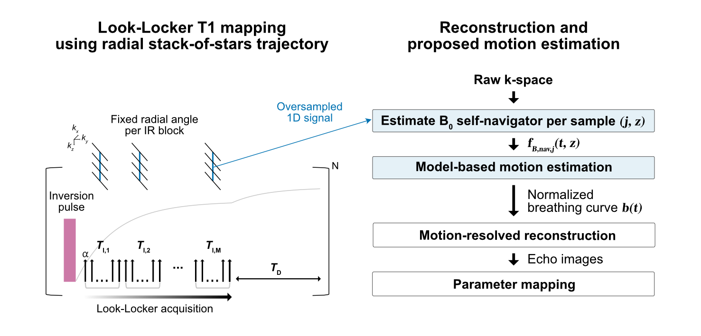
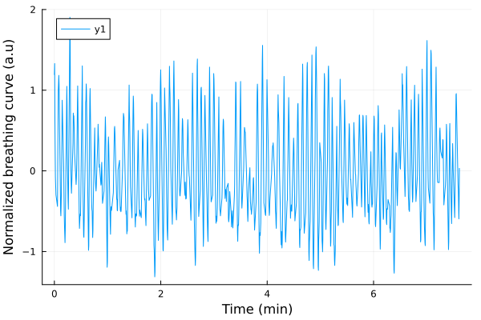

# B0 self-navigation for respiratory motion estimation in liver Look-Locker T1 mapping

Implementation of the Dixon B0 self-navigator to perform respiratory motion estimation in liver Look-Locker T1 mapping using a radial stack-of stars trajectory. 



## 🚀 Setup

### Dependencies
- Julia (v1.11 recommended)
- [Mamba](https://mamba.readthedocs.io/en/latest/) package manager (for Python dependencies)

### Install

**Clone the repo and run setup script:**

```shell
    git clone https://github.com/BMRRgroup/B0nav-LL.git
    cd B0nav-LL
    ./setup.sh
```

The setup.sh script creates a new Mamba environment with the Python dependencies and configures the executable Python file from this environment as the Python path for PyCall.jl. An argument can be passed to the setup.sh script to change the name of the Mamba environment (default: B0nav-LL).

### Run

**Run the Pluto programming environment and open the notebooks (theory_simulation.jl, invivo_example.jl) directly in your browser:**

```shell
    julia -e 'using Pkg; Pkg.activate("."); using Pluto; Pluto.run()'
```

## Data
An example in vivo dataset for running the B0 navigator and motion estimation algorithms are provided in */data*.

## Expected outputs
### theory_simulation.jl: _B0 navigator in simplified two-species model_
#### Case 1: $\varrho_1$, $\varrho_2$ water
Estimated $f_{B,nav}$ for the different TIs in Hz: [49.2, 21.7, 69.1, 59.6, 55.9, 53.9, 52.4]

#### Case 2: $\varrho_1$ water, $\varrho_2$ fat
Estimated $f_{B,nav}$ for the different TIs in Hz (water-fat model): [33.9, 33.2, 70.6, 63.1, 51.4, 44.7, 40.9]

### invivo_example.jl: _In vivo motion estimation_


Median B0 variation amplitude $\gamma$ across slices/coils in Hz: 7.1 \
Maximum B0 variation amplitude $\gamma$ across slices/coils in Hz: 53.0

## License
This project is licensed as given in the LICENSE file. However, used submodules / projects may be licensed differently. Please see the respective licenses.